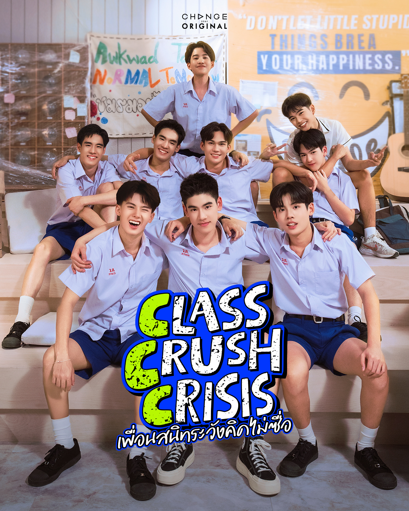

**阅读须知:** 本文由非专业人士翻译，仅供学习与交流使用，不保证译文完全准确，建议阅读原文，以获得最佳体验，具体原文请点击链接查看。 [《Class Crush Crisis เพื่อนสนิทระวังคิดไม่ซื่อ》](https://www.readawrite.com/a/Zh6val-Class-Crush-Crisis-%E0%B9%80%E0%B8%9E%E0%B8%B7%E0%B9%88%E0%B8%AD%E0%B8%99?r=search_article).

**声明:**

1、本作品严禁用于任何商业用途，未经许可请勿二次转载或随意篡改内容。

2、版权归原作者及版权方所有，如涉及侵权，请联系本人删除。

## **00 INTRODUCTION**

“要不要来猜一下，看这一局谁会先到终点。”

“这还用猜吗，肯定是腿最长的那个人赢啊。”

“这个猜测听起来好蠢。”

操场上喧闹一片，一群穿着运动服，脚踩白色帆布鞋的高中女生，为此正聊得热火朝天，在她们面前的，便是学校那片露天体育场的塑胶跑道。

“各就各位了吗？”

男生们已在八条跑道上各就各位，在不远处的场地周围，聚集着一群为他们加油打气的同学们；其中有90%都是女生，大家兴奋地在为选手加油，因为体育课很少会组织比赛。

尤其是组织了两个班的男生来比赛。

“老师先点名啊。”

五十岁左右的男子一边说着，一边将目光投向最内侧的跑道，那就是一号跑到所在的位置，“Put。”

“到！”话音刚落，少年立刻应声并举手示意。老师便将笔尖落在点名册上，与此同时，被叫到名字的少年缓缓弯下腰，并摆好了起跑姿势。

双手撑在起跑线后，一只脚向前跨出，后背挺直，双眼注视着地面，他努力集中注意力，全神贯注于即将开始的两百米赛跑。

“我赌Putter赢。”

“我也。”在老师继续点名时，场边的女生们纷纷开始发表见解。

“TungPanithan。”

“准备好了，老师！”

刚回答完，观众席便立刻爆发出了汹涌的尖叫声。那位拥有高挑身材的人听到尖叫声后，动力更足了，于是趁机拼命地散发魅力。他向同学们送出一个飞吻，接着又做了一个Wink抛过去。

“谁支持TungTae？”眨眼间，那片区域的许多人都唰地一下举起了手。

“Ekachat。”

“到！”

“我的话，选Indy赢。”

“Indy最多就跑第三而已，他什么时候喜欢过跑步了。”

“一切皆有可能，说不定这次会爆冷门呢。”

猜输赢的活动还在继续，直到所有人的目光都集中到最后一个人身上，那就是八号跑道的位置。是一位长相帅气的少年，但表情却极度平静，从他脸上看不出任何情绪。

“Itthadol。”

“到。”

操场区域陷入了一阵短暂的沉默，随后带着疑惑的声音开口问道：

“没有人看好Lirit吗？”

“他帅气地呆着就可以了。”

尽管听起来有些伤心，但大家似乎都心知肚明，八号跑道的选手率先冲线的可能性微乎其微。

“所有人，准备……”

选手们弓起臀部，头部和肩膀微微前倾，将重心压在手臂和前脚上。紧接着，哨声响起，比赛正式开始。

操场边的拉拉队激动地大叫起来，有人在大喊选手的名字，而有的则兴奋得手舞足蹈，不管有没有不小心撞到旁边的人，现场一片混乱。画面切回到赛场上的激烈角逐……

Putter遥遥领先，把其他人甩在身后。

而TungTae根本不在乎比赛，反而选择向朋友们散发魅力，他一边跑一边对着拉拉队比心。

Indy几乎是垫底，因为他这辈子最讨厌的就是跑步，他越跑越没耐心，于是他破罐子破摔，索性赌气地背对着终点倒着跑。

至于Lirit，从起点冲出去没多久就偏离了跑道。他的目标并不是终线，而是一颗正从足球场滚出来的足球。

不用猜也知道，这次比赛获胜的人是Putter。

猜对的人再次响起一阵欢呼，只有体育老师无奈地摇着头，他正低头按照赛道冲线顺序记录着，随后忍不住开口抱怨道：

“虽然体育课不像其他学科那么重要，但也不能这么散漫啊。”老师话还没说完，下课铃声就响了，这使得一名学生立刻大声问道：

“老师，可以下课了吗？”

“行行行，下课。顺便帮我转告Itthadol，让他下节课来补跑。”

“好——”

大家各自散去。然而，那个没得分的Lirit还在坚持地想要捡回那颗球，并热心地将球扔回去给运动场中间的学弟们……

## 关于Lerit名字翻译说明

- Lirit的名字，在泰语原文里写作：ลีร์อิต อิตธาดล ปุญเวช，在招商预告里面，官方给出来英文写法是Leelth。我在这里之所以翻译写出来变成Lirit，是因为以下原因：.

1、他的小名原本叫"ลีร์(Lir)"，除了有一个"ลี(Lir/Lee)"的发音之外，还有一个添加了不发音符号("  ์ ")的"ร/r"，即是" ร์ "，发音的时候是没有的，但在书写形式上保留了，这是明确存在的，为了保留这个姓名在视觉和逻辑上的完整性，我选择在译名中保留 r。；

2、他提到他以前班里有两个人的小名发音都叫"ลี(Li/Lee)"，同学们为了把他们区分开来，就将他的大名"อิตธาดล(Itthadol)"的首音节也加到他的小名里。所以我认为结合拼写逻辑和他姓名更改的原因，" Lirit" 相比官方招商预告给出的" Leelth " 更为合适，所以最后决定将他的小名译为：Lir + it = Lirit 。
